# 🇳🇬 NYSC Smart Companion (AI-Powered)

   

> **"The Ultimate Digital Survival Kit for Every Nigerian Corps Member."**

**NYSC Smart Companion** is not just a bot; it's a revolutionary, AI-driven assistant designed to transform the NYSC experience. We bridge the gap between confusion and clarity, ensuring every PCM and Corps Member has instant access to accurate information, automated tools, and a supportive community.

---

## ⚡ Quick Links
- **🌐 Live App**: [https://nysc-smart-bot.vercel.app](https://nysc-smart-bot.vercel.app)
- **🔌 API Documentation**: [https://nysc-bot-api.onrender.com/docs](https://nysc-bot-api.onrender.com/docs)
- **📱 Telegram Bot**: *(t.me/@nyscsmartbot)*

---

## 🏗️ System Architecture

A robust, scalable architecture powered by modern tech stacks to ensure 99.9% uptime and real-time responsiveness.

```mermaid
graph TD
    User([User Device]) -->|HTTPS| Frontend["⚛️ React Frontend (Vite + PWA)"]
    
    subgraph "Frontend Layer"
        Frontend -->|State| Context["Auth & Data Context"]
        Frontend -->|UI| Components["Glassmorphism UI Components"]
    end
    
    Frontend <-->|REST API| LoadBalancer["🌐 Load Balancer / Proxy"]
    LoadBalancer <-->|JSON| Backend["🐍 FastAPI Backend Server"]
    
    subgraph "Backend Core"
        Backend -->|Auth| Security["JWT Authentication & RBAC"]
        Backend -->|Logic| Routers["Service Routers (Admin, Clearance, News)"]
        Backend -->|Tasks| Scheduler["⏱️ APScheduler (Background Jobs)"]
    end
    
    subgraph "Data Persistence"
        Backend <-->|ORM| DB[("🐘 PostgreSQL / SQLite")]
        Backend <-->|Files| Cloud["☁️ Cloudinary Storage"]
    end
    
    subgraph "AI Intelligence Engine"
        Backend <-->|Query| LangChain["🦜🔗 LangChain Agent"]
        LangChain <-->|Retrieval| VectorDB["📚 ChromaDB (Internal Knowledge)"]
        LangChain <-->|Inference| LLM["🤖 OpenAI / Gemini Pro"]
        LangChain <-->|Search| WebSearch["🕷️ Tavily Search API (Real-Time News)"]
    end
```

---

## ✨ Features That Wow

### 🧠 **Hybrid AI Core**
- **RAG + Real-Time Web Search**: Combines official NYSC Bye-Laws (Vector Store) with **live web search** to answer questions like *"Is the 2025 Senate List out?"* with pinpoint accuracy.
- **Context-Aware**: It knows who you are. The AItailors responses differently for a PCM vs. a Serving Corps Member.

### 🎨 **Visual Excellence**
- **Glassmorphism Design**: A stunning, modern interface featuring frosted glass cards, vibrant gradients, and smooth **Framer Motion** animations.
- **Mobile-First Experience**: Designed like a native app with a bottom navigation bar, touch-optimized controls, and responsive layouts.

### 🔐 **Secure & Functional**
- **Role-Based Dashboards**:
    *   **PCMs**: Track Mobilization status, view Orientation Checklists, and get "Next Step" guidance.
    *   **Corps Members**: Manage Monthly Clearance, PPA details, and CDS attendance.
- **Real-Time Notifications**: Smart toast notifications alert you instantly when new news drops.

### 🛠️ **Power Tools**
- **ID Card Generator**: Instantly generate a preview of your NYSC ID card.
- **Biometric Upload**: Seamlessly upload and track your biometric verification slips.
- **Resource Library**: One-click access to official PDF guides and forms.

---

## ☕ Support the Project

Building the future of NYSC digital services takes caffeine and code! If you find this project helpful, consider supporting the development.

## 📞 Contact
For inquiries, bug reports, or feature requests:
- **Email**: hello@CryptoLab-service.com
- **Twitter**: [@CryptoLab](https://twitter.com)

---

> **Made with ❤️ for Nigerian Corpers.**  
> *Service and Humility.*
